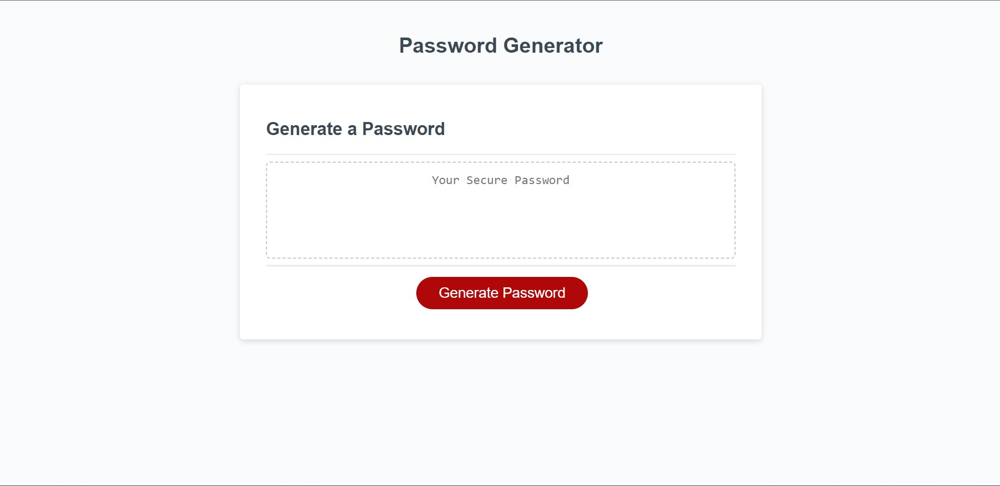

# Password Generator

## Description

This application creates a random password generator which can be used to create a password of a given length between 10-64 characters. The user can decide to include special characters (!"?>&), numeric characters, lower and uppercase characters, and once decided, the random password is output to the page.

The following functionality is present:

* Generate a password when the Generate Password button is clicked
  * Present a prompt requesting the user to input the length of password
      * At least 10 characters but no more than 64.
    * Present a confirm pop-up requesting the user select which character types to include:
      * Special characters ($@%&*, etc)
      * Numeric characters
      * Lowercase characters
      * Uppercase characters
  * At least one character type should be selected, or an alert will display asking the user to input again
  * Once prompts are answered then the password is generated and written to the page

I have used a series of functions to create this password generator, along with if and else if statements to guide the user journey. In order to use the full selection of characters, I have concatenated the data arrays based on user selections via the prompts. Finally, I have used Math.floor and Math.random to calculate the password length based on user input.

## Screenshot

## Links

GitHub repository: https://github.com/zaitken1/password-generator

Live application: https://zaitken1.github.io/password-generator/